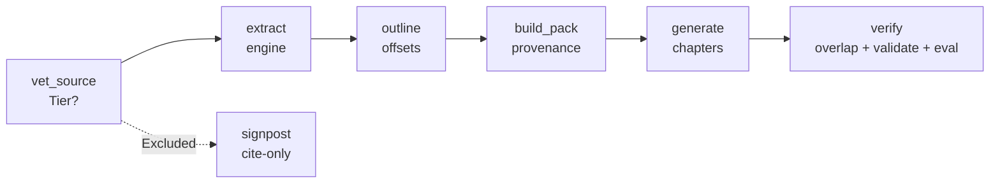

<!-- Copyright (c) 2026 JG Systems Consulting Ltd. — MIT License (see LICENSE). SPDX-License-Identifier: MIT -->

# jgs-reference-skill

[](LICENSE)
[](CHANGELOG.md)
[](SKILL.md)
[](https://claude.com/claude-code)

**Turn a vetted authoritative source — a standard, handbook, guidebook, or
framework — into a licence-clean, citable knowledge pack your agent loads on
demand.** A fork of [book-to-skill](https://github.com/virgiliojr94/book-to-skill)
(MIT), repositioned from *personal study skills* to *publishable reference packs*.

## Why a fork

book-to-skill turns a book into a study skill. It has no notion of who owns the
source, whether you may redistribute it, or whether the skill quotes the original
verbatim. For **published** reference packs over authoritative sources, those are
the whole game. jgs-reference-skill keeps book-to-skill's proven output shape and adds
the provenance, licence, and verification rigor — the things you otherwise do by
hand every time.

| | book-to-skill | jgs-reference-skill |
|---|---|---|
| Target | personal study notes | publishable reference oracle |
| Licence awareness | none | **vet gate**: Tier 1/2/3/Excluded, refuses non-redistributable |
| Provenance | none | `PACK.yaml` + per-pack `LICENSE` (SPDX, tier, NC/SA flags) |
| Verbatim copying | "don't" (unchecked) | **`check_overlap.py`** flags any lifted run |
| Chapter slicing | ad-hoc grep | **`outline.py`** deterministic offsets |
| Index quality | — | **`pack_eval.py`** verifies routes are grounded |
| Unredistributable source | (would package it) | **signpost** (cite-only, zero content) |

## Pipeline



## Install

```bash
git clone https://github.com/jgsystemsconsulting/jgs-reference-skill
cd jgs-reference-skill
python install.py                 # Claude Code (default), namespaced under ~/.claude/skills/jgs/
python install.py --agent all     # every user-global agent
python install.py --list-agents   # show each agent's target path + format
```

Restart your agent session, then run `/jgs-reference-skill`. For Codex, Gemini, or
Cursor (and their limitations), see [docs/other-agents.md](docs/other-agents.md).

### Install with your AI agent

Paste this into Claude Code, Cursor, or another coding agent and it will install the
skill for you:

> Install the **jgs-reference-skill** agent skill (v0.1.0) from
> `https://github.com/jgsystemsconsulting/jgs-reference-skill`.
> 1. Clone the repo and read its `README.md` and `docs/skill-usage.md` first.
> 2. Check prerequisites: Python ≥ 3.9 on `PATH`.
> 3. Run `python install.py --agent <your agent>` (default Claude Code; use
>    `--list-agents` to see every target/format).
> 4. Verify: re-run `python install.py --list-agents`, confirm the skill folder/prompt
>    now exists at the printed target, restart the session, and confirm
>    `/jgs-reference-skill` resolves.
> 5. Note the licence: the tooling is MIT, but **packs you generate carry their
>    source's licence** — read `docs/SOURCE-VETTING.md` before packaging anything.

## Usage — build a pack (CLI)

```bash
# 1. Vet the source FIRST — refuses paywalled / all-rights-reserved sources
python3 tools/vet_source.py --title "NASA SE Handbook" --publisher "NASA" \
    --license "Public Domain (US Government work)"

# 2. Scaffold a pack with provenance (re-runs the gate, infers tier + flags)
python3 tools/build_pack.py --slug nasa-se-handbook \
    --title "NASA Systems Engineering Handbook (SP-2016-6105 Rev 2)" \
    --publisher "NASA" --version "Rev 2 (2016)" \
    --license "Public Domain (US Government work)"

# 3. Extract + outline, then generate the pack (agent follows SKILL.md)
python3 scripts/extract.py path/to/source.pdf --mode technical
python3 tools/outline.py --source /tmp/book_skill_work/full_text.txt --out outline.json

# 4. Verify before publishing — all three must pass
python3 tools/check_overlap.py --source /tmp/book_skill_work/full_text.txt --pack packs/nasa-se-handbook
python3 tools/validate_pack.py packs/nasa-se-handbook
python3 tools/pack_eval.py --pack packs/nasa-se-handbook
```

As an agent skill, install it where your host discovers skills (e.g.
`~/.claude/skills/jgs-reference-skill/`) and drive it conversationally — see
[SKILL.md](SKILL.md). It vets, extracts, outlines, scaffolds, generates, and runs
the three gates for you.

## What it produces

```
packs/<slug>/
├── SKILL.md        core frameworks + chapter index + topic index + scope-limits
├── PACK.yaml       provenance: title, publisher, version, licence, tier, NC/SA flags
├── LICENSE         the SOURCE's terms (independent of this repo's MIT)
├── chapters/chNN-*.md   on-demand, citation-grounded
├── glossary.md · patterns.md · cheatsheet.md
```

A pack drops straight into the JGSC `jgs-se-knowledge-packs` repository and passes its
release gates unmodified.

## Tools (all pure stdlib, all `--self-check`)

| Tool | Does |
|---|---|
| `tools/vet_source.py` | licence tier classification + Excluded hard-stop |
| `tools/build_pack.py` | vet-gated provenance scaffold |
| `tools/outline.py` | deterministic ToC + char/line offsets (JSON) |
| `tools/check_overlap.py` | verbatim n-gram overlap detector |
| `tools/validate_pack.py` | structural + licence validator (signpost-aware) |
| `tools/pack_eval.py` | topic-index-to-chapter grounding check |

## Licence

Tooling + spec: **MIT** — see [LICENSE](LICENSE) (© 2026 JG Systems Consulting Ltd.).
The extraction engine is vendored from book-to-skill (MIT, © 2025 virgiliojr94) — see
[ATTRIBUTION.md](ATTRIBUTION.md) and [NOTICE](NOTICE). Packs you produce carry **their
source's** licence, not this one. Read [docs/SOURCE-VETTING.md](docs/SOURCE-VETTING.md)
before packaging anything.

## Support

- **Questions / bugs:** open an issue on the [repository](https://github.com/jgsystemsconsulting/jgs-reference-skill/issues).
- **Security issues:** do **not** open a public issue — see [SECURITY.md](SECURITY.md)
  (report to `jason.gower@jgsystemsconsulting.com`).
- **Contributing:** see [CONTRIBUTING.md](CONTRIBUTING.md).
